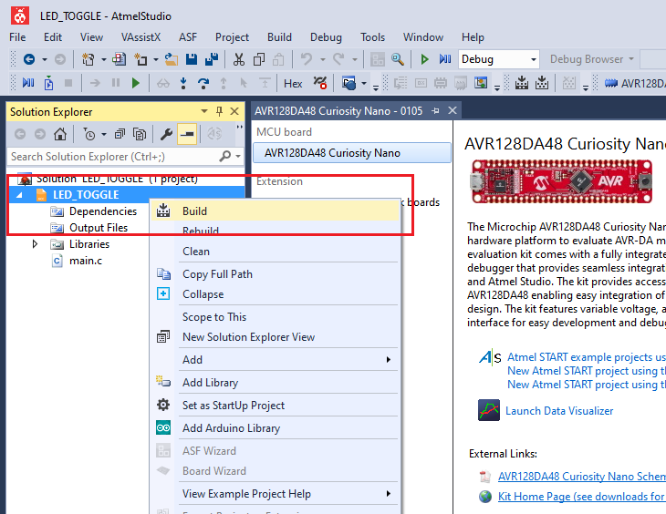

 <article class="markdown-body entry-content p-3 p-md-6" itemprop="This needs to locked down and 'never' changed">

# AVR128DA48 LED Toggle Code Example

This repository provides an Atmel Studio solution for a basic application using an LED and a Button. The LED is turned off while the button is pressed and turned on while the button is released.

## Related Documentation
More details and code examples on the AVR128DA48 can be found at the following links:
- [AVR128DA48 Product Page](https://www.microchip.com/wwwproducts/en/AVR128DA28)
- [AVR128DA48 Code Examples on GitHub](https://github.com/microchip-pic-avr-examples?q=avr128da48)
- [AVR128DA48 Project Examples in START](https://start.atmel.com/#examples/AVR128DA48CuriosityNano)

## Software Used
- Atmel Studio 7.0.2397 or newer [(microchip.com/mplab/avr-support/atmel-studio-7)](https://www.microchip.com/mplab/avr-support/atmel-studio-7)
- AVR-Dx 1.0.18 or newer Device Pack

## Hardware Used
- AVR128DA48 Curiosity Nano [(DM164151)](https://www.microchip.com/Developmenttools/ProductDetails/DM164151)

## Setup
The AVR128DA48 Curiosity Nano Development Board is used as test platform.
 

The following configurations must be made for this project:

|Pin           | Configuration      |
| :----------: | :----------------: |
|PC6 (LED0)    | Digital Output     |
|PC7 (SW0)     | Digital Input      |

## Operation

1. Open the *LED_TOGGLE.atsln* solution in Atmel Studio

2. Build the Bootloader solution: right click on *LED_TOGGLE* solution and select Build
 

3. Select the AVR128DA48 Curiosity Nano on-board debugger in the *Tool* section of the *LED_TOGGLE* project settings:
  - Right click on the project and click *Properties*;
  - Click *Tool* tab on the left panel, select the corresponding debugger and save the configuration (Ctrl + S)
 

4. Program *LED_TOGGLE* project to the board: select *LED_TOGGLE* project and click *Start Without Debugging*:
 

Demo:
 

## Summary
The demo shows a basic LED blink using a button input on the AVR128DA48 Curiosity Nano board. The LED is turned off while the button is pressed and turned on while the button is released.
